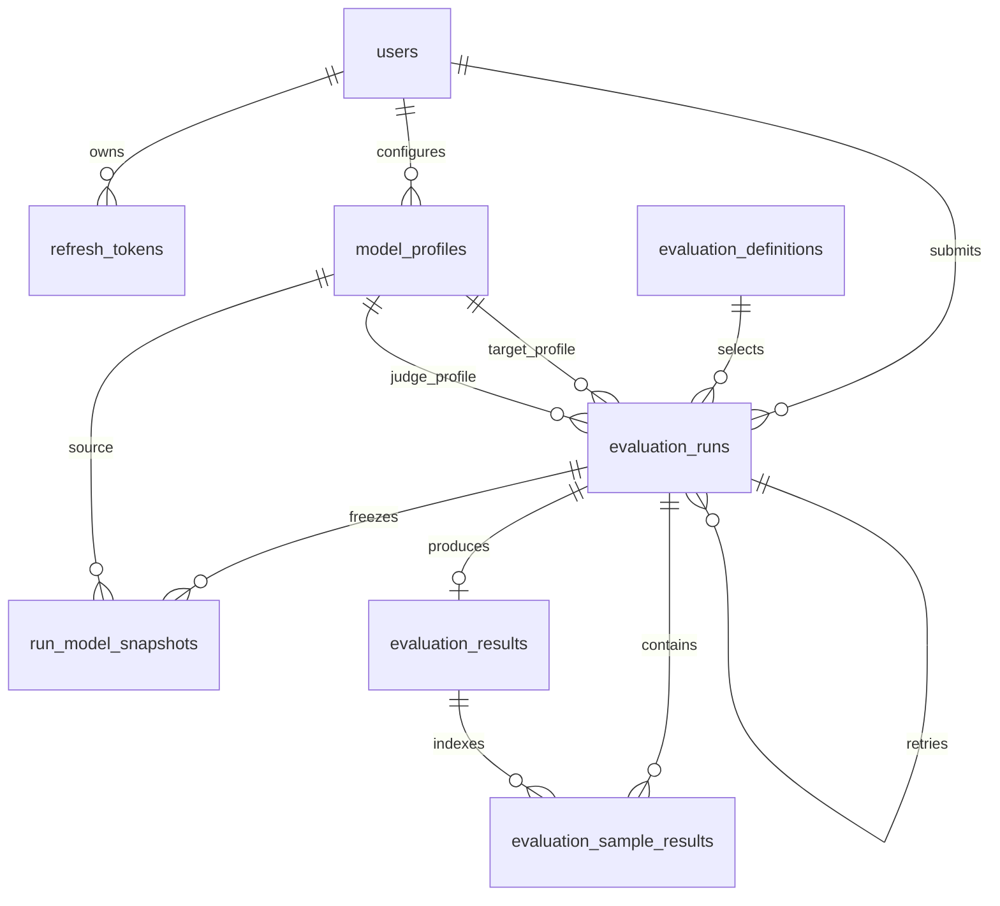

# Medical Evals 数据库设计

当前后端使用 SQLAlchemy Core 表定义，数据库迁移由 Alembic 管理。生产部署默认使用 PostgreSQL；本地测试和兼容路径也支持 SQLite。数据库保存身份、模型配置、测评运行、运行快照、汇总结果和逐样本结果。Redis 只承担异步队列职责，不是业务状态的最终来源。

## 1. 实体关系

`evaluation_definitions` 与 `evaluation_definition_splits` 共同构成可审计的数据集目录。创建运行时会把选定 split、配置和模型 profile 固化到运行记录及快照中，模型名称与 Base URL 从运行快照读取；运行的 dataset version 和 rubric 仍通过目录解析，因此已有 split 的版本映射应保持不变，新增版本应使用新的目录标识。

## 2. 表设计

### `users`

保存登录身份和授权角色。

| 字段 | 类型 | 约束/用途 |
| --- | --- | --- |
| `id` | `VARCHAR(36)` | 主键，UUID 字符串 |
| `username` | `VARCHAR(255)` | 非空、唯一 |
| `password_hash` | `VARCHAR(255)` | 非空，只保存密码哈希 |
| `role` | `VARCHAR(32)` | 非空，默认 `user`；管理员使用 `admin` |
| `status` | `VARCHAR(32)` | 非空，默认 `active` |
| `created_at` / `updated_at` | `TIMESTAMP WITH TIME ZONE` | 非空，数据库默认当前时间 |

索引：唯一约束 `username`，普通索引 `ix_users_status`。

### `refresh_tokens`

保存可撤销的刷新令牌记录。原始 token 不入库，只保存 `token_hash`。

| 字段 | 类型 | 约束/用途 |
| --- | --- | --- |
| `id` | `VARCHAR(36)` | 主键 |
| `user_id` | `VARCHAR(36)` | 外键到 `users.id`，用户删除时级联删除 |
| `token_hash` | `VARCHAR(255)` | 非空、唯一 |
| `expires_at` | `TIMESTAMP WITH TIME ZONE` | 非空，过期时间 |
| `revoked_at` | `TIMESTAMP WITH TIME ZONE` | 可空；撤销时写入 |
| `created_at` | `TIMESTAMP WITH TIME ZONE` | 非空，默认当前时间 |

索引：`ix_refresh_tokens_user_id`。

### `model_profiles`

保存用户可复用的模型连接配置。`api_key_encrypted` 是加密密文；API 响应不会返回 API key。

| 字段 | 类型 | 约束/用途 |
| --- | --- | --- |
| `id` | `VARCHAR(36)` | 主键 |
| `user_id` | `VARCHAR(36)` | 外键到 `users.id`，用户删除时级联删除 |
| `name` | `VARCHAR(255)` | profile 展示名 |
| `base_url` | `TEXT` | OpenAI-compatible 服务地址 |
| `model_name` | `VARCHAR(255)` | 供应商侧模型名 |
| `api_key_encrypted` | `TEXT` | 非空，加密后的 API key |
| `is_active` | `BOOLEAN` | 非空，默认 `true` |
| `created_at` / `updated_at` | `TIMESTAMP WITH TIME ZONE` | 非空 |

约束：`(user_id, name)` 唯一，避免同一用户的管理 profile 重名。索引：`ix_model_profiles_user_id`。公众用户重复提交同一模型时，服务层会生成不同的内部 profile 名称，保留每次提交的凭据隔离。

### `evaluation_definitions`

保存可供工作台选择的评测定义及其默认配置。

| 字段 | 类型 | 约束/用途 |
| --- | --- | --- |
| `id` | `VARCHAR(64)` | 主键，对应内置定义 ID |
| `name` | `VARCHAR(255)` | 展示名称 |
| `kind` | `VARCHAR(64)` | 评测类型，如 exact 或 rubric |
| `dataset_version` | `VARCHAR(255)` | 当前默认数据集版本标识 |
| `requires_judge` | `BOOLEAN` | 非空，默认 `false` |
| `default_config_json` | `JSON` | 非空，保存默认 split、样本上限、Judge profile 等配置 |
| `is_enabled` | `BOOLEAN` | 非空，默认 `true` |
| `created_at` / `updated_at` | `TIMESTAMP WITH TIME ZONE` | 非空 |

应用层从数据库读取定义和 split；启动时只用版本化内置 seed 为历史数据库补齐目录。禁用定义或 split 不会出现在可提交目录中。Registry 文件仍是数据内容本身，数据库目录记录其相对路径和可用时的 SHA-256 指纹。

### `evaluation_definition_splits`

保存一个评测定义可用的 dataset split、版本和审计元数据。

| 字段 | 类型 | 约束/用途 |
| --- | --- | --- |
| `id` | `VARCHAR(64)` | 联合主键的一部分，定义内的 split ID |
| `evaluation_definition_id` | `VARCHAR(64)` | 外键到 `evaluation_definitions.id`，删除定义时级联 |
| `dataset_version_id` | `VARCHAR(255)` | 非空、全局唯一，运行时使用的版本标识 |
| `version` | `VARCHAR(64)` | 数据集版本号 |
| `sample_count` | `INTEGER` | 非空，已登记样本数 |
| `default_sample_limit` | `INTEGER` | 非空，公众提交默认上限 |
| `rubric_id` | `VARCHAR(255)` | 非空，评测使用的 rubric |
| `source_path` | `TEXT` | 非空，Registry 或 workspace 数据文件相对路径 |
| `source_sha256` | `VARCHAR(64)` | 可空；源文件存在时记录 SHA-256 |
| `is_enabled` | `BOOLEAN` | 非空，默认 `true` |
| `created_at` / `updated_at` | `TIMESTAMP WITH TIME ZONE` | 非空 |

约束：`(evaluation_definition_id, id)` 为联合主键，`dataset_version_id` 全局唯一。索引：`ix_evaluation_definition_splits_definition_id`、`ix_evaluation_definition_splits_is_enabled`。

### `evaluation_runs`

保存一次测评从排队到终态的完整状态，是 Worker 与 API 共享的业务主表。

| 字段 | 类型 | 约束/用途 |
| --- | --- | --- |
| `id` | `VARCHAR(36)` | 主键，也是运行/任务 ID |
| `user_id` | `VARCHAR(36)` | 外键到 `users.id`，用户删除时级联删除 |
| `name` | `VARCHAR(255)` | 非空，运行名称；重试运行会生成 retry 后缀 |
| `evaluation_definition_id` | `VARCHAR(64)` | 外键到 `evaluation_definitions.id` |
| `target_model_profile_id` | `VARCHAR(36)` | 外键到 `model_profiles.id` |
| `judge_model_profile_id` | `VARCHAR(36)` | 可空外键；仅 rubric 评测需要 |
| `retry_of_run_id` | `VARCHAR(36)` | 可空自引用外键，指向原始运行 |
| `status` | `VARCHAR(32)` | 非空；`queued`、`running`、`completed`、`partial_failed`、`failed`、`cancelled` |
| `split` | `VARCHAR(64)` | 选中的数据集 split |
| `max_samples` | `INTEGER` | 可空；空值表示使用全部样本 |
| `config_json` | `JSON` | 非空，本次运行的合并配置 |
| `progress_json` | `JSON` | 非空，完成数、总数、百分比、成功/失败/重试数和 stage |
| `error` | `TEXT` | 可空，面向运行记录的错误信息 |
| `lease_owner` | `VARCHAR(255)` | 可空，当前 Worker 标识 |
| `lease_expires_at` | `TIMESTAMP WITH TIME ZONE` | 可空，lease 到期时间 |
| `queued_at` / `started_at` / `finished_at` | `TIMESTAMP WITH TIME ZONE` | 排队、开始、结束时间；后两者可空 |
| `created_at` / `updated_at` | `TIMESTAMP WITH TIME ZONE` | 非空 |

索引：`ix_evaluation_runs_user_id`、`ix_evaluation_runs_status`、`ix_evaluation_runs_lease_expires_at`。`lease_expires_at` 用于回收 Worker 中断后遗留的任务；`retry_of_run_id` 用于保留重试链，不覆盖原始运行。

### `run_model_snapshots`

在运行创建时冻结 Target/Judge profile 的关键字段，避免 profile 后续修改导致历史结果无法复现。

| 字段 | 类型 | 约束/用途 |
| --- | --- | --- |
| `id` | `VARCHAR(36)` | 主键 |
| `run_id` | `VARCHAR(36)` | 外键到 `evaluation_runs.id`，运行删除时级联删除 |
| `profile_role` | `VARCHAR(32)` | 非空，通常为 `target` 或 `judge` |
| `source_model_profile_id` | `VARCHAR(36)` | 可空外键到源 profile |
| `display_name` | `VARCHAR(255)` | 运行时显示名 |
| `base_url` | `TEXT` | 运行时服务地址 |
| `model_name` | `VARCHAR(255)` | 运行时模型名 |
| `api_key_encrypted` | `TEXT` | 运行时加密凭据 |
| `created_at` | `TIMESTAMP WITH TIME ZONE` | 非空 |

约束：`(run_id, profile_role)` 唯一。该表包含加密凭据，访问和备份应沿用主数据库的密钥管理与权限策略。

### `evaluation_results`

保存一次运行的聚合结果和 artifact 索引。`result_version` 当前为 `workbench.result.v2`，让读取方可以选择兼容解析器；历史记录缺少该字段时按 `workbench.result.v1` 读取。

| 字段 | 类型 | 约束/用途 |
| --- | --- | --- |
| `id` | `VARCHAR(36)` | 主键 |
| `run_id` | `VARCHAR(36)` | 外键到 `evaluation_runs.id`，级联删除；唯一，一次运行至多一个汇总结果 |
| `result_version` | `VARCHAR(64)` | 结果 schema/序列化版本 |
| `summary_json` | `JSON` | 总分、准确率、解析成功率、错误分类和维度分数等 |
| `artifact_index_json` | `JSON` | 日志、summary、samples、checkpoint 等工件的索引 |
| `created_at` / `updated_at` | `TIMESTAMP WITH TIME ZONE` | 非空 |

索引：`ix_evaluation_results_run_id`。唯一 `run_id` 保证重试运行产生新 run，而不会覆盖原 run 的结果。

### `evaluation_sample_results`

保存分页读取所需的逐样本结果；完整输出和日志可同时位于 Artifact Storage。

| 字段 | 类型 | 约束/用途 |
| --- | --- | --- |
| `id` | `VARCHAR(36)` | 主键 |
| `run_id` | `VARCHAR(36)` | 外键到 `evaluation_runs.id`，级联删除 |
| `evaluation_result_id` | `VARCHAR(36)` | 可空外键到 `evaluation_results.id`，结果删除时级联删除 |
| `sample_index` | `INTEGER` | 非空，运行内样本序号 |
| `sample_id` | `VARCHAR(255)` | 可空，数据集侧样本 ID |
| `status` | `VARCHAR(32)` | 非空，样本成功、失败或解析失败状态 |
| `score` | `NUMERIC(10,4)` | 可空，标准化样本分数 |
| `judge_json` | `JSON` | 可空，HealthBench/Rubric 判断明细 |
| `artifact_refs_json` | `JSON` | 非空，关联输出、日志等工件引用 |
| `output_artifact_path` | `TEXT` | 可空，原始输出工件路径 |
| `created_at` / `updated_at` | `TIMESTAMP WITH TIME ZONE` | 非空 |

索引：`ix_evaluation_sample_results_run_id`、`ix_evaluation_sample_results_status`，以及唯一复合索引 `ix_evaluation_sample_results_run_id_sample_index`，防止同一运行重复写入同一序号。

## 3. 删除、隔离与一致性规则

- 删除用户会级联删除其 refresh token、model profile 和 evaluation run；运行下的 snapshots、results、sample results 也会因级联关系清理。
- 管理员可以读取全局运行；普通用户查询运行和模型 profile 时必须经过 ownership 过滤，不能只依赖前端隐藏。
- `evaluation_runs` 的状态由 repository/Worker 推进，数据库当前主要使用字符串字段表达状态，合法转换由应用层常量和 Worker 流程保证。
- 运行配置、进度、结果摘要和 rubric 明细使用 JSON，以适应 MedQA 与 HealthBench 不同的指标结构；需要稳定查询的字段（状态、用户、运行、样本序号）保持独立列和索引。
- Redis 消息确认不代表业务完成：Worker 先写 PostgreSQL 终态和结果，再 ack 队列消息。Redis 故障时，数据库状态和 reconcile 逻辑保证任务可恢复。
- 结果摘要使用 `workbench.result.v2`，artifact 目录使用 `workbench.artifacts.v1` 的 `manifest.json`，结构化运行事件使用 `workbench.event.v1` 的 `events.jsonl`；版本字段让新 schema 可以和旧运行并存。

## 4. 迁移与初始化

Alembic 迁移位于 `backend/alembic/versions/`：

1. `0001_initial_workbench` 创建上述核心表、外键、唯一约束和基础索引。
2. `0002_evaluation_run_leases` 为 `evaluation_runs` 增加 `name`、`lease_owner`、`lease_expires_at`，并为已有运行回填名称；随后建立 lease 到期索引。
3. `0003_dataset_catalog` 创建 `evaluation_definition_splits`，为已有定义回填 dataset split、版本、样本数、rubric 和源文件路径；应用初始化会继续补齐可用源文件的 SHA-256。

应用启动脚本会执行 `python -m medical_evals_api.cli init-db`，通过 `upgrade_database()` 将配置数据库升级到 Alembic `head`。新增字段或约束应先写迁移，再同步更新 `backend/medical_evals_api/database.py` 的 metadata、repository 映射和相关测试；不要直接修改已执行迁移的历史文件。

## 5. 当前设计的边界

数据库目录已经覆盖 definition、split、dataset version、样本数、rubric 和源文件指纹。后续若需要按租户发布目录、记录更细的许可/来源信息或管理数据文件生命周期，可继续拆分 dataset、dataset_versions 和 rubric 表；运行仍应保存不可变的版本快照。
